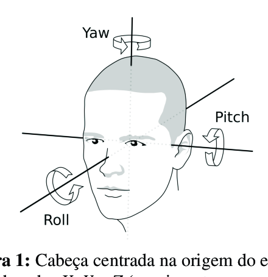

# Proyecto de VPC (Computer Vision 2)

> Nota: El dataset MPIIFaceGaze.h5 debe estar en datasets/MPIIFazeGaze.h5 para que los notebooks funcionen correctamente

El sistema de coordenadas de ángulos en 3D sigue el siguiente formato:

`gaze = [pitch,yaw]`

